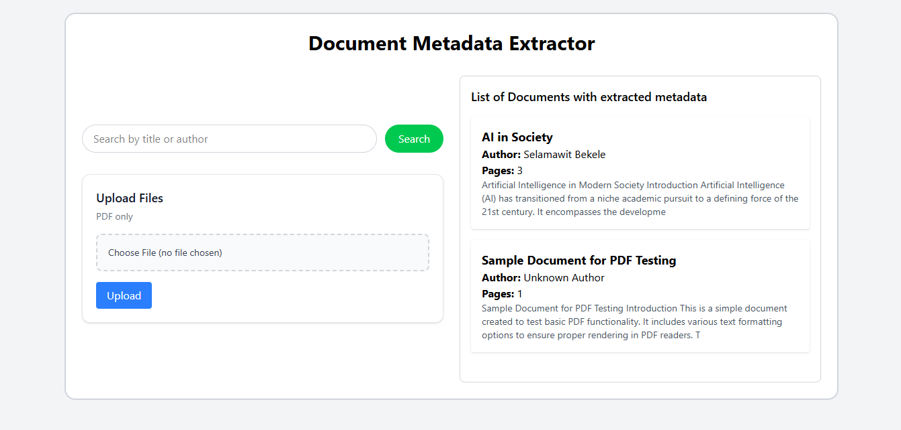
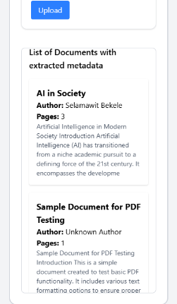

# 📄 Document Metadata Extraction & Search Interface

## 🚀 Overview

This project is a full-stack application that allows users to upload PDF documents, automatically extract metadata, store it in a database, and search through stored documents.

It demonstrates backend API development, file handling, database design, and frontend integration.

---

## 🧩 Features

* Upload PDF documents
* Extract metadata:

  * Title
  * Author
  * Page count
  * Text excerpt (first 200 characters)
* Store metadata in SQLite database
* View all uploaded documents
* Search documents by title or author

---

## 🛠️ Tech Stack

### Backend

* FastAPI
* SQLite
* SQLAlchemy
* PyMuPDF

### Frontend

* React (Vite + TypeScript)
* Tailwind CSS

---

## 📂 Project Structure

```
doc-metadata-extractor/
├── backend/
│   └── app/
│       ├── main.py
│       ├── database.py
│       ├── models.py
│       ├── schemas.py
│       ├── crud.py
│       └── utils/pdf_extractor.py
│
├── frontend/
│   └── src/
│       ├── api/
│       ├── components/
│       ├── App.tsx
│       └── main.tsx
│
└── README.md
```

---

## 🔌 API Endpoints

#### POST /upload
  - Upload a PDF file and extract metadata

#### GET /documents
  - Retrieve all documents metadata

#### GET /documents?search=keyword
  - Search documents by title or author

#### GET /documents/{id}
  - Retrieve a specific document

---

## ⚙️ Setup Instructions

### Backend

  1. Open a terminal in the backend directory.
  2. Create and activate a virtual environment.
  3. Install dependencies.
  4. Run the API server.

* Backend URL: http://127.0.0.1:8000

```
cd backend
python -m venv venv
source venv/bin/activate   # Linux/macOS
venv\Scripts\activate      # Windows

pip install fastapi uvicorn sqlalchemy pymupdf python-multipart
uvicorn app.main:app --reload
```

API Docs:
http://127.0.0.1:8000/docs

---

### Frontend

  1. Open a second terminal in the frontend directory.
  2. Install dependencies.
  3. Start the development server.
```
cd frontend
npm install
npm run dev
```

  App will be available at:
  * http://localhost:5173

  Make sure the backend server is running at:
  * http://127.0.0.1:8000

---

## 🔄 Data Flow

1. User selects a PDF file in the UI.
2. Frontend sends file to POST /upload.
3. Backend saves file and extracts metadata with PyMuPDF.
4. Backend writes metadata to SQLite.
5. Frontend fetches records from GET /documents.
6. User can search with GET /documents?search=....

---
## Notes
If PDF metadata is missing, fallback values are used:
  - Unknown Title
  - Unknown Author

## 📌 Status

✔ Backend completed
✔ Frontend completed
✔ Full system working

---s

# 📷 Screenshots





---
## Future Improvements
  - Add unique filename generation
  - Add file size limits and stronger validation
  - Add pagination for large document lists
## 📄 License

This project is for educational purpose.